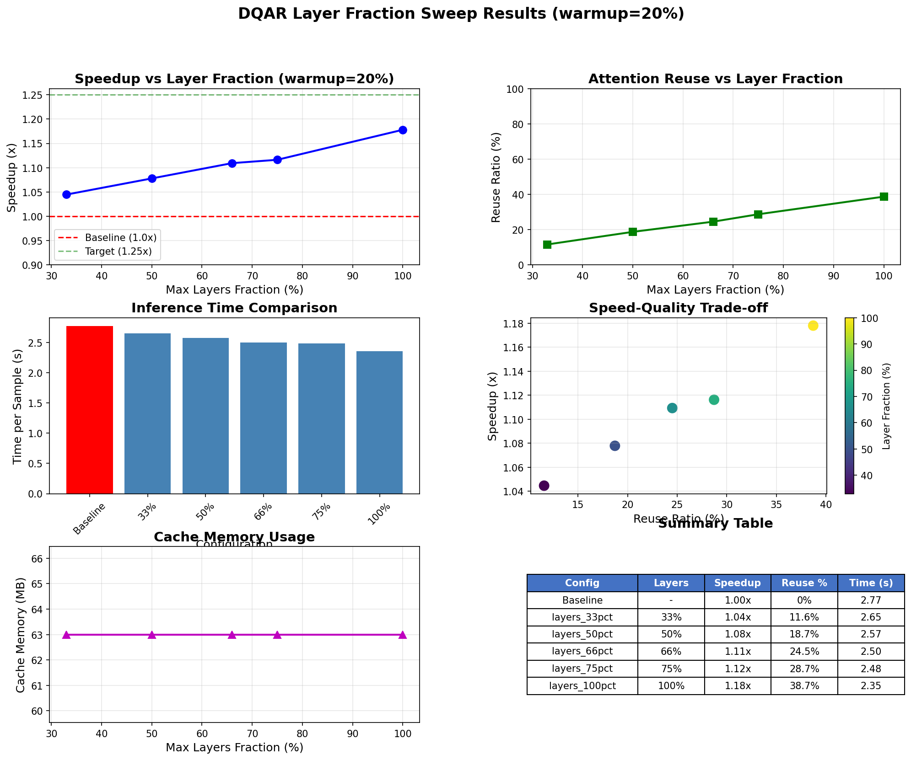

# DQAR Layer Fraction Sweep Results

**Date**: 2025-12-02 03:27:53
**Device**: NVIDIA A100-SXM4-40GB
**Model**: DiT-XL-2-256
**Fixed Warmup**: 20%

---

## Summary

| Metric | Value |
|--------|-------|
| **Best Speedup** | 1.18x (layers_100pct) |
| **Baseline Time** | 2.77s/sample |
| **Target Met** | Yes (>=1.15x) |

---

## Detailed Results

| Layer Fraction | Speedup | Reuse Ratio | Time/Sample | Cache (MB) |
|----------------|---------|-------------|-------------|------------|
| Baseline | 1.00x | 0% | 2.77s | 0 |
| 33% | 1.04x | 11.6% | 2.65s | 63.0 |
| 50% | 1.08x | 18.7% | 2.57s | 63.0 |
| 66% | 1.11x | 24.5% | 2.50s | 63.0 |
| 75% | 1.12x | 28.7% | 2.48s | 63.0 |
| 100% | 1.18x | 38.7% | 2.35s | 63.0 |

---

## Plots

---

## Analysis

- **Lowest layer fraction (33%)**: 1.04x speedup, 11.6% reuse
- **Highest layer fraction (100%)**: 1.18x speedup, 38.7% reuse
- **Speedup increase**: 0.13x from 33% to 100% layers
- **Reuse increase**: 27.1% from 33% to 100% layers

---

## Recommendations

**Recommended Configuration**: 100% layer fraction
- Achieves 1.18x speedup
- Uses 38.7% attention reuse
- Minimum layers needed to meet 1.15x target

---

*Report generated by DQAR layer sweep benchmark*
