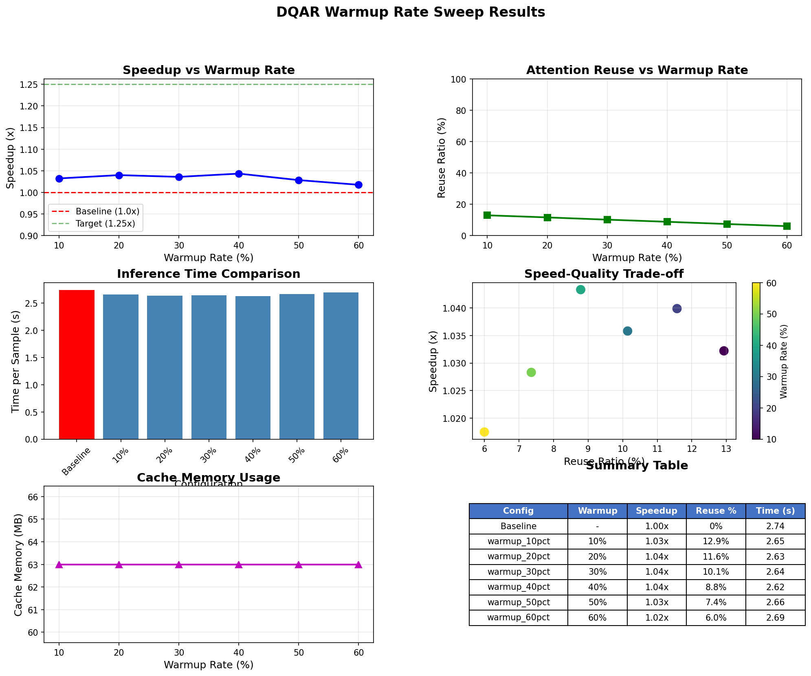

# DQAR Warmup Rate Sweep Results

**Date**: 2025-12-02 03:16:05
**Device**: NVIDIA A100-SXM4-40GB
**Model**: DiT-XL-2-256

---

## Summary

| Metric | Value |
|--------|-------|
| **Best Speedup** | 1.04x (warmup_40pct) |
| **Baseline Time** | 2.74s/sample |
| **Target Met** | No (>=1.15x) |

---

## Detailed Results

| Warmup Rate | Speedup | Reuse Ratio | Time/Sample | Cache (MB) |
|-------------|---------|-------------|-------------|------------|
| Baseline | 1.00x | 0% | 2.74s | 0 |
| 10% | 1.03x | 12.9% | 2.65s | 63.0 |
| 20% | 1.04x | 11.6% | 2.63s | 63.0 |
| 30% | 1.04x | 10.1% | 2.64s | 63.0 |
| 40% | 1.04x | 8.8% | 2.62s | 63.0 |
| 50% | 1.03x | 7.4% | 2.66s | 63.0 |
| 60% | 1.02x | 6.0% | 2.69s | 63.0 |

---

## Plots

---

## Recommendations

No configuration met the 1.15x speedup target.
Consider using lower warmup rates or enabling more layers.

---

*Report generated by DQAR warmup sweep benchmark*
